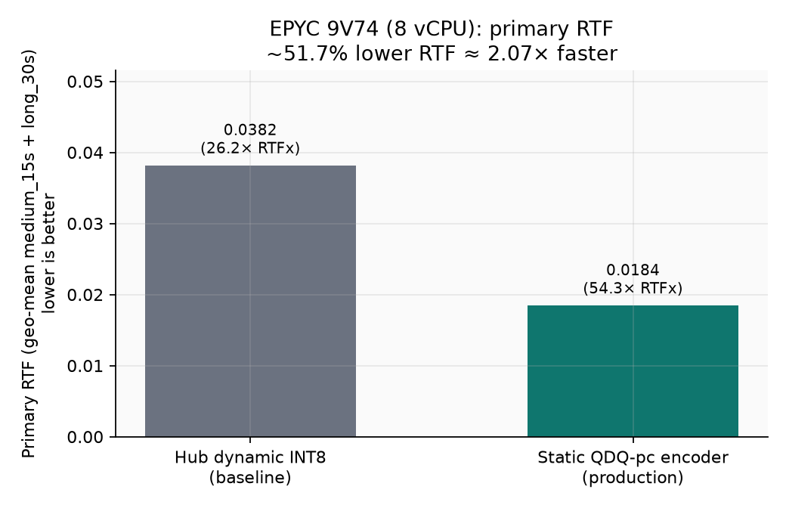
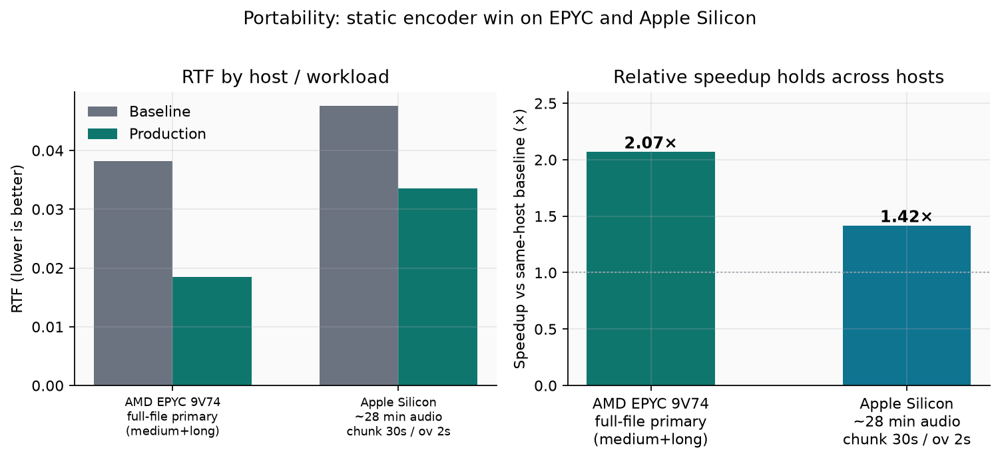
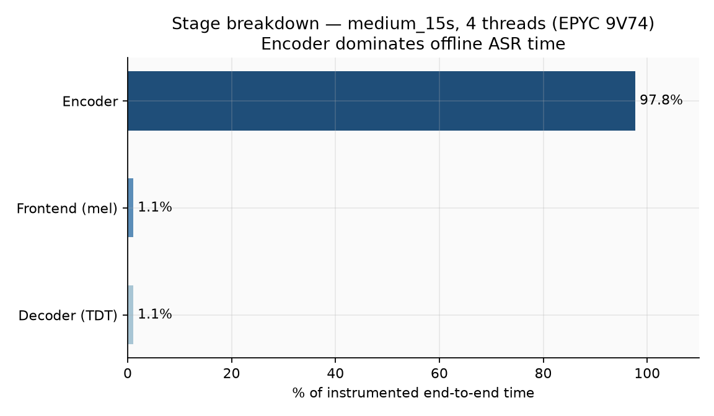
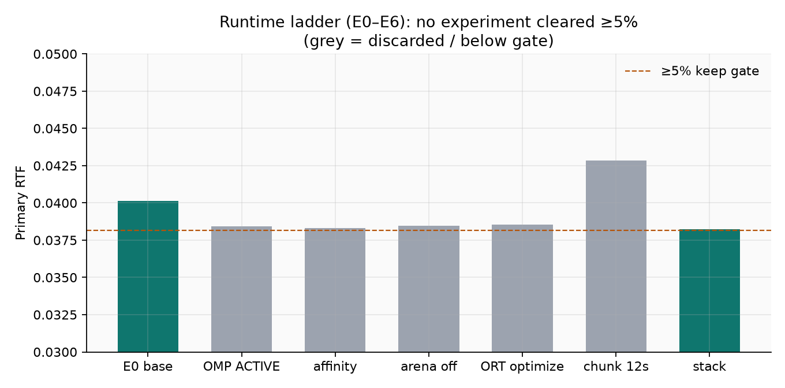
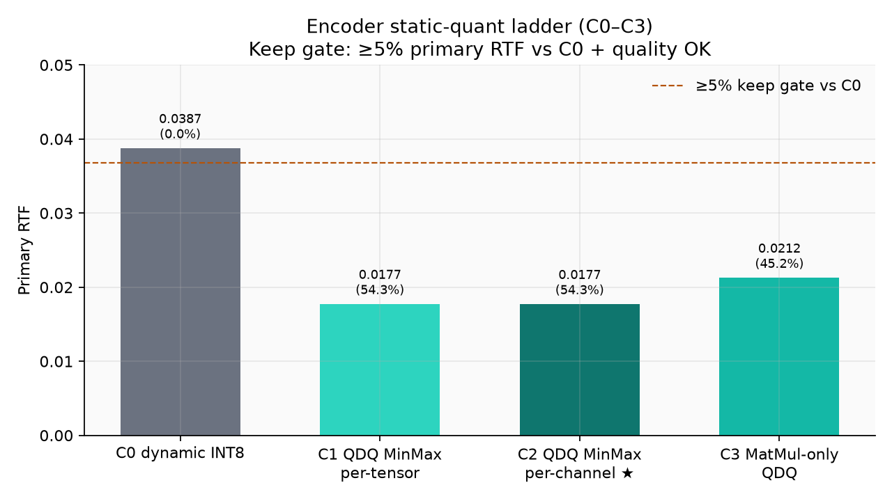
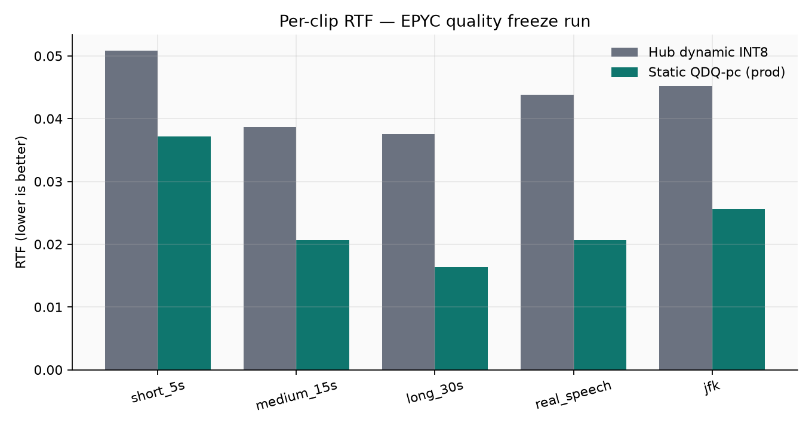

# Making Parakeet TDT 0.6B v3 faster on CPU: a measured optimization case study

**Repo:** [gauravvij/parakeet-optimization](https://github.com/gauravvij/parakeet-optimization)  
**Production weights:** [gvij/parakeet-tdt-0.6b-v3-onnx-static-qdq-pc](https://huggingface.co/gvij/parakeet-tdt-0.6b-v3-onnx-static-qdq-pc)  
**Baseline weights:** [istupakov/parakeet-tdt-0.6b-v3-onnx](https://huggingface.co/istupakov/parakeet-tdt-0.6b-v3-onnx)  
**Personal workflow write-up:** [using-neo-grok-parakeet-cpu.md](using-neo-grok-parakeet-cpu.md)

This write-up is a technical record of how Neo (an autonomous AI engineering agent) took a high-level goal, built a CPU profiling and experiment harness around NVIDIA Parakeet TDT 0.6B v3 in ONNX, ran keep/discard ladders, froze a production config, and published code plus weights. The work was driven end to end inside Neo’s VS Code harness with **Grok 4.5 (xAI)** as the model via Neo’s Bring Your Own LLM Key (BYOK) path. That matters less as branding and more as a practical note: long multi-step ML research loops (profile → hypothesize → implement → gate → discard) are exactly where a strong reasoning model plus an agent that can write and run code pays off.

Audience assumption: you already know what RTF, ONNX Runtime, and static vs dynamic INT8 mean. Trivial setup steps are skipped unless something unexpected forced a fix.

---

## Outcome in one table

| Host / path | Baseline | Production | Relative |
|-------------|----------|------------|----------|
| **AMD EPYC 9V74**, 8 vCPU, full-file, primary RTF = geo-mean(`medium_15s`, `long_30s`) | RTF **0.038156** (~26.2× RTFx) | RTF **0.018432** (~54.3× RTFx) | **~51.7% lower RTF ≈ 2.07×** |
| **Apple Silicon** (user Mac), ~28 min English speech, chunk window 30 s / overlap 2 s, `intra=8` | RTF **0.047576** (~21.0×) | RTF **0.033564** (~29.8×) | **~29.5% lower RTF ≈ 1.42×** |

Quality freeze on EPYC (small English set, not a full multilingual suite): absolute JFK WER **0.0** for both configs; pairwise mean WER **~0.087** (3/5 exact normalized match; diffs concentrated on looped synthetic tails). Decision: **FREEZE_PRODUCTION**.





Absolute RTFx is host- and path-specific. The portable claim is the **relative** static-vs-dynamic encoder win, not “54× everywhere.”

---

## Starting point

Target model: **nvidia/parakeet-tdt-0.6b-v3**, consumed as **INT8 ONNX** via `onnx-asr` + ONNX Runtime CPU EP (no GPU on the primary host).

Public dynamic INT8 pack used as baseline:

- `istupakov/parakeet-tdt-0.6b-v3-onnx`
- encoder ~652 MB INT8, decoder joint ~18 MB, `nemo128` frontend, vocab/config

Primary host:

- AMD EPYC 9V74, 8 logical CPUs, AVX-512 + VNNI  
- ORT 1.27.0, providers effectively `CPUExecutionProvider` (Azure EP present but not the optimization story)  
- ~63 GB RAM  

Metric design (fixed before the ladders so we would not move goalposts):

- **Primary speed:** geometric mean of mean RTF on `medium_15s` and `long_30s` (lower better)  
- **Keep gate:** ≥ **5%** primary RTF improvement vs reference + quality OK  
- **Quality:** non-empty real speech; normalized match or high token overlap vs reference; later absolute JFK WER for freeze  

Warmup 1 + repeats 3 for timed `recognize()` paths. Shell `time` includes model load; production numbers use warm inference / `--benchmark` style measurement.

---

## Phase 1: Profile before optimizing

Neo built a profiling harness (`scripts/profile_parakeet_cpu.py`) rather than guessing knobs.

### What the stage split said

On `medium_15s` at 4 threads, instrumented stages:

| Stage | Share |
|-------|------:|
| Encoder (FastConformer) | **~97.8%** |
| Frontend (mel / STFT path) | ~1.1% |
| Decoder (TDT joint) | ~1.1% |



Offline batch=1 throughput is **encoder-bound**. Tuning the TDT decoder first would have been the wrong ROI.

### What the ORT operator profile said

Inside the encoder profile window, after stripping session scaffolding noise, the heavy kernels were the usual INT8 suspects:

- `ConvInteger`  
- `DynamicQuantizeMatMul` / `MatMulIntegerToFloat`  

Attention softmax was a small fraction after 8× subsampling. Thread scaling 1→4 was strong; 4→8 still helped longer audio on this 8-vCPU box, with the usual diminishing returns.

**Implication for the experiment plan:** runtime thread/env polish might buy a few percent. Anything that changes **how the encoder is quantized or executed** is where a ≥5% keep might live.

### Unexpected fix (load path)

`onnx-asr`’s Hub glob for INT8 (`encoder-model?int8.onnx`) does **not** match Hub filenames `encoder-model.int8.onnx`. Automatic snapshot patterns failed; Neo switched to **explicit `hf_hub_download`** of the INT8 file list into a local dir and load with `quantization='int8'`. That detail is now documented in the repo README so others do not burn an hour on empty model dirs.

---

## Phase 2: Runtime autoresearch ladder (E0–E6)

Script: `scripts/autoresearch_cpu_opts.py`  
Ledger: `results/autoresearch/ledger.jsonl`

Design: sequential keep/discard experiments against a rolling best, same primary metric and quality gate.

| Bucket | What was tried | Result |
|--------|----------------|--------|
| Threads / OMP | 4 vs 8; PASSIVE vs ACTIVE; affinity | 8 threads clearly better than 4 (~20%). ACTIVE/affinity ~4–4.6% vs E0, **below 5% gate** |
| Session | mem pattern, CPU arena, parallel execution | Arena/mem variants ~1–4%. Parallel execution **hurt** badly |
| Graph | Offline ORT optimize into a new model dir (E3) | ~4% , **no keep** |
| EP | OpenVINO (E4) | **Skipped**: OpenVINO not in providers; optional install avoided to not replace the working ORT CPU wheel |
| Chunking | App-level window + concat on long audio (E5) | **Regressed** long_30s RTF 20–35% (extra session overhead, no encoder cache). Not a speed keep |
| Stack | Best residual knobs (E6) | ~4.8%, still under gate |



**Conclusion from E0–E6:** on this host and model, **runtime-only knobs do not clear a honest ≥5% gate**. The stack still ships sensible defaults (`intra=8`, `inter=1`, `ORT_ENABLE_ALL`, OMP PASSIVE) because they are correct operationally, not because they were the big win.

That negative result is useful. It stopped the project from shipping a pile of env-var folklore as “optimization.”

---

## Phase 3: Encoder static-quant ladder (C0–C3)

Script: `scripts/autoresearch_encoder_opts.py`  
Ledger: `results/autoresearch_encoder/ledger.jsonl`

Hypothesis aligned with the profile: dynamic quant MatMuls pay a runtime tax; **static QDQ** on the FP32 encoder (calibrated, then exported) should cut encoder time if quality holds. Decoder/frontend stayed Hub dynamic INT8.

Calibration used mel features through `nemo128` (not raw waveforms). Builds assembled full packs under `models/…` with external data for large encoder weights.

| ID | Variant | Primary RTF | vs C0 | Keep |
|----|---------|------------:|------:|:----:|
| C0 | Hub-style dynamic INT8 | 0.038742 | - | ref |
| C1 | QDQ MinMax **per-tensor** | 0.017709 | **+54.3%** | yes |
| C2 | QDQ MinMax **per-channel** | **0.017692** | **+54.3%** | **best** |
| C3 | MatMul/Gemm-only QDQ (+ some stack knobs) | 0.021249 | +45.2% | yes (not best) |



C2 won by a hair over C1; both crushed the 5% gate with quality OK on the ladder’s real-speech check. Production freeze later remeasured C2-class pack at primary RTF **0.018432** vs baseline **0.038156** (**51.7%**).

### Dead ends Neo hit and worked around (not theory)

These are the non-obvious failures that cost real iterations:

1. **QOperator + per-channel** on the full FastConformer encoder failed (unknown initializers / Softmax-conv intermediates). **QDQ format** worked.  
2. **Percentile calibration** failed on variable-length mel batches (`inhomogeneous shape`). **MinMax** was reliable without padding gymnastics.  
3. **`quant_pre_process`** paths failed to serialize cleanly in places; quantizing the raw FP32 encoder with QDQ MinMax was the path that shipped.  
4. Disk pressure: FP32 encoder is multi-GB; after static export it was freed. Large ONNX stays **out of git** (HF only).  
5. Security/policy on the sandbox blocked naive `rm` of absolute paths; cleanup used `pathlib` unlink from project cwd.

None of that is glamorous. All of it is the difference between a blog claim and a pack that actually loads.

---

## Phase 4: Quality assessment and production freeze

Script: `scripts/quality_baseline_vs_best.py`  
Report: `results/quality_baseline_vs_best.md` + `.json`  
Freeze doc: `reports/production_default.md`

Compared baseline (`configs/baseline.json` → Hub dynamic pack) vs best (`configs/best_config.json` / `production.json` → static QDQ-pc pack) on the same clips.



Gates for freeze:

- No empty real-speech transcripts  
- Pairwise quality vs baseline acceptable on this set  
- Absolute JFK WER 0.0 both sides  
- Primary RTF improvement ≥5% (measured **51.7%**)  

**Caveat (stated in-repo):** the eval set is small and mostly clean English (JFK line and loops). It is a **regression gate**, not a substitute for LibriSpeech / multilingual WER. If you extend this work, replace or grow that set first.

Also fixed along the way: `onnx-asr` / `wave` only likes WAV; FLAC JFK samples are converted to temp 16 kHz PCM before `recognize`.

Frozen production leaves `"chunking": null` (full-file path for short/medium RTF). Multi-minute files can OOM as encoder activations scale with T. Later, Neo added **CLI chunking** on `apply_best_config.py` (`--chunk-window-s` / `--chunk-overlap-s`) as an app-level escape hatch. That is for memory and long talks, **not** the frozen primary-RTF recipe (E5 already showed window+concat is not free speed).

---

## Phase 5: Publish and portability check

- **GitHub:** code, configs, scripts, results, sample audio, docs. ONNX weights gitignored.  
- **Hugging Face:** production static pack + model card under `gvij/…`.  
- **Apple Silicon:** same packs and CLI; user-measured long-audio A/B (~1.42×). README documents both hosts so people do not treat EPYC RTFx as universal.

Docs were tightened so **A/B and quality replication require both packs** (production + Hub baseline), not only the static download.

---

## What Neo actually did (process, not mythology)

This case study was not a hand-authored notebook with a few charts. From a single high-level goal, Neo:

1. Explored the model packaging and host constraints  
2. Implemented profiling and metric collection  
3. Designed keep/discard ladders with fixed gates  
4. Ran experiments, logged ledgers, discarded noise  
5. Hit real quant/export failures and patched the approach  
6. Froze production, wrote reports, published git + HF  
7. Extended for long-audio CLI and dual-host docs when the product path needed it  

The agent loop matters: **implement → run → read stderr/metrics → edit → re-run**. Grok 4.5 via BYOK was the planner/coder brain inside that harness for this run. If you care about reproducibility of *agency*, the artifacts are the ledgers and scripts in the repo, not a chat transcript.

---

## How to replicate

```bash
git clone https://github.com/gauravvij/parakeet-optimization.git
cd parakeet-optimization
python3 -m venv venv && source venv/bin/activate
pip install -U pip && pip install -r requirements.txt
```

Download **both** packs if you want A/B or `quality_baseline_vs_best.py` (see README / `models/README.md`):

1. Production: `gvij/parakeet-tdt-0.6b-v3-onnx-static-qdq-pc` → `models/parakeet-tdt-0.6b-v3-onnx-static-qdq-pc/`  
2. Baseline: `istupakov/parakeet-tdt-0.6b-v3-onnx` INT8 files → `models/parakeet-tdt-0.6b-v3-onnx/`  

```bash
# Production warm RTF
python scripts/apply_best_config.py --config configs/production.json \
  --audio data/real_speech.wav --benchmark

# Baseline A/B
python scripts/apply_best_config.py --config configs/baseline.json \
  --audio data/real_speech.wav --benchmark

# Quality + primary RTF remeasure
python scripts/quality_baseline_vs_best.py --warmup 1 --repeats 3

# Long audio (memory), not the freeze RTF path
python scripts/apply_best_config.py --config configs/production.json \
  --audio /path/to/long.wav --chunk-window-s 30 --chunk-overlap-s 2 --benchmark
```

---

## How to extend this with Neo

Clone the repo, open it in VS Code (or Cursor) with the Neo extension, point BYOK at a strong model (this study used **Grok 4.5**), and give a **goal + constraints**, not a step list. Examples that build on this codebase:

**OpenVINO / EP bake-off (never completed here)**  
> Using this repo’s baseline and production packs, add an optional OpenVINO or ORT EP comparison on my CPU. Keep the same primary RTF definition and quality gates as `quality_baseline_vs_best.py`. Do not break the existing CPU EP path. Report keep/discard vs production with a ledger.

**Real WER suite**  
> Replace the small JFK-based quality set with a proper English ASR subset (e.g. LibriSpeech test-clean sample). Re-run baseline vs production, keep RTF primary metric, and only freeze if WER regression stays under X%.

**INT4 / mixed precision probe**  
> Design a quality-gated encoder quant experiment beyond C2 (e.g. INT4 or mixed) with the same ≥5% RTF gate and a hard WER ceiling. Discard anything that fails quality even if it is faster.

**Apple Silicon backend**  
> On macOS, evaluate Core ML / ANE (or another local path) against the current ORT CPU production pack on the same long-audio file and chunk settings. Report RTF and transcript diffs; do not claim portability to EPYC.

**Smaller model tradeoff**  
> Find a smaller public Parakeet (or distill path) and run the same static-quant + quality protocol. I care about 3× vs Hub dynamic INT8 on CPU if WER stays within Y.

**Server throughput**  
> Add multi-stream / batch throughput benchmarks (not single-file RTF) for the production pack and document the metric separately from primary RTF.

Pattern that works well with Neo: **metric definition + keep gate + quality gate + “do not re-run dead ends in `failed-approaches`”**. Point it at this repo’s ledgers so it does not rediscover that E5 chunking is not a speed win.

---

## Limits (read these before citing the 2×)

1. **Same architecture.** Static QDQ is standard ORT quant on the public encoder, not a new FastConformer.  
2. **Quality set is thin.** Good for freeze/regression, weak for absolute ASR claims.  
3. **OpenVINO not measured.** Could still matter on some Intel boxes; unknown here.  
4. **3–4× vs Hub baseline** likely needs a smaller model and/or a different backend (e.g. ANE), not another E-ladder pass. Runtime knobs already failed the 5% gate.  
5. **Chunking ≠ free speed.** It bounds RAM on multi-minute audio; E5 showed it can worsen RTF without true streaming/cache.

---

## Artifacts map

| Path | Role |
|------|------|
| `scripts/profile_parakeet_cpu.py` | RTF + stage/operator profiling |
| `scripts/autoresearch_cpu_opts.py` | E0–E6 runtime ladder |
| `scripts/autoresearch_encoder_opts.py` | C0–C3 static quant ladder |
| `scripts/quality_baseline_vs_best.py` | Freeze quality + primary RTF |
| `scripts/apply_best_config.py` | Config-driven inference, benchmark, long-audio CLI chunking |
| `configs/baseline.json` / `production.json` | A/B and freeze configs |
| `results/autoresearch*/ledger.jsonl` | Experiment truth |
| `reports/parakeet_tdt_v3_cpu_optimization.md` | Full profiling write-up |
| `reports/production_default.md` | Freeze decision |
| `blog/assets/*.png` | Figures used in this post |

---

## Bottom line

On EPYC, **static QDQ MinMax per-channel on the Parakeet TDT 0.6B v3 encoder** cut primary RTF by about **half** versus the public dynamic INT8 ONNX pack (~**2.07×**), with freeze gates green on a small English set. On Apple Silicon long audio with chunking, the same packs still showed a clear relative win (~**1.42×**). Runtime-only tuning did not clear a 5% keep gate. The encoder was always the bottleneck; the ladders just forced that conclusion with numbers instead of intuition.

If you want the code and weights, use the links at the top. If you want the next experiment, clone the repo and hand Neo a gated goal. That is how this one was produced.
